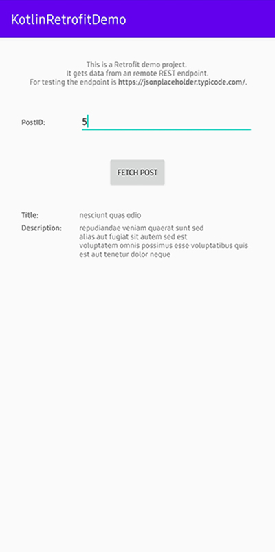

# Kotlin Retrofit Demo

## Summary

This project includes a demo of the Retrofit Library. This Library is used to fetch data from an remote API. For this project https://jsonplaceholder.typicode.com/ is used for the remote DataSource.

## Showcase

## Core Features

* Rest API Calls with Retrofit
* JSON parsing with Gson